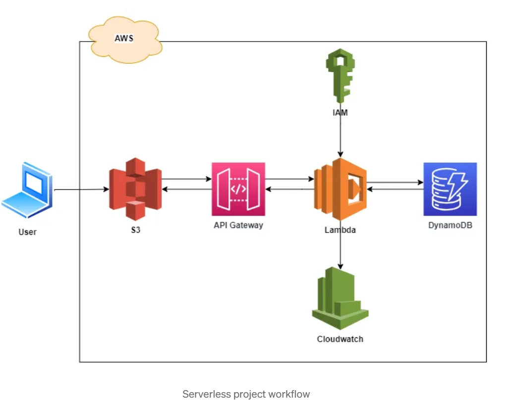

# Serverless-Infra
A serverless contact form that allows users to submit inquiries or messages through a web interface. The submitted messages are stored in a database for later retrieval and review. The application leverages various AWS services such as AWS Lambda, API Gateway, DynamoDB, and S3.



## Lambda.zip
```
https://s3.eu-west-1.amazonaws.com/www.profesantos.cloud/Severless/Website-Form/lambda.zip
```

## S3 Policy
```
{
    "Version": "2012-10-17",
    "Statement": [
        {
            "Sid": "PublicReadGetObject",
            "Effect": "Allow",
            "Principal": "*",
            "Action": "s3:GetObject",
            "Resource": "arn:aws:s3:::<your-bucket>/*"
        }
    ]
}
```
## Test Lambda
```
{
  "name": "myname",
  "email": "mymail@example.com",
  "subject": "lambda-testing",
  "message": "A message from lambda"
}
```
## S3 CORS
```
[
    {
        "AllowedHeaders": [
            "*"
        ],
        "AllowedMethods": [
            "POST"
        ],
        "AllowedOrigins": [
            "*"
        ],
        "ExposeHeaders": []
    }
]
```

## Links
```
https://medium.com/@venkatagiri.sasanapuri/serverless-web-application-in-aws-703afb83b8ac
https://medium.com/cloud-native-daily/revolutionizing-web-development-creating-serverless-contact-forms-with-aws-8d2f2220329a
```
